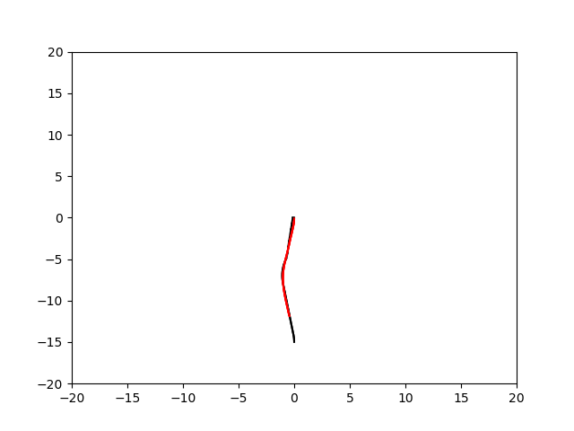

# Pure Pursuit
This repository is used to store the implement of Pure Pursuit for [OpenAVP](https://github.com/OpenAVP) project.
```angular2html
Currently, Pure Pursuit here is just a basic version with minimum implement
```



## Get start
1. install dependence
```shell
pip install numpy
pip install matplotlib
```

## Usage
### Run simple test
Class `SimpleTest` in `PurePursuit.py` contains support for simple test.
1. read reference path file by using static method `simple_read`
2. run simple test path by using method `offline_test`
3. (`main.py` provide an example for simple test)

### To use as plugin
1. `PurePursuit` instances are solvers of Pure Pursuit.
2. calculating steer of vehicle in the next step using method `one_step`

## To be constructed
1. support for test in [Carla](https://github.com/OpenAVP/CARLA-Server)
